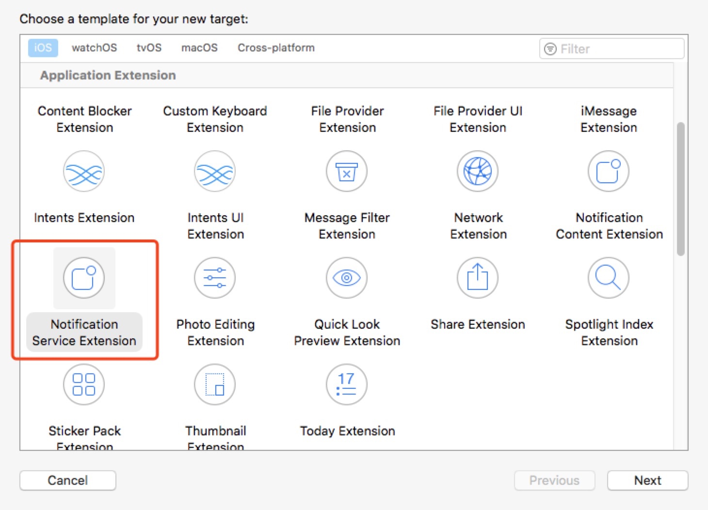
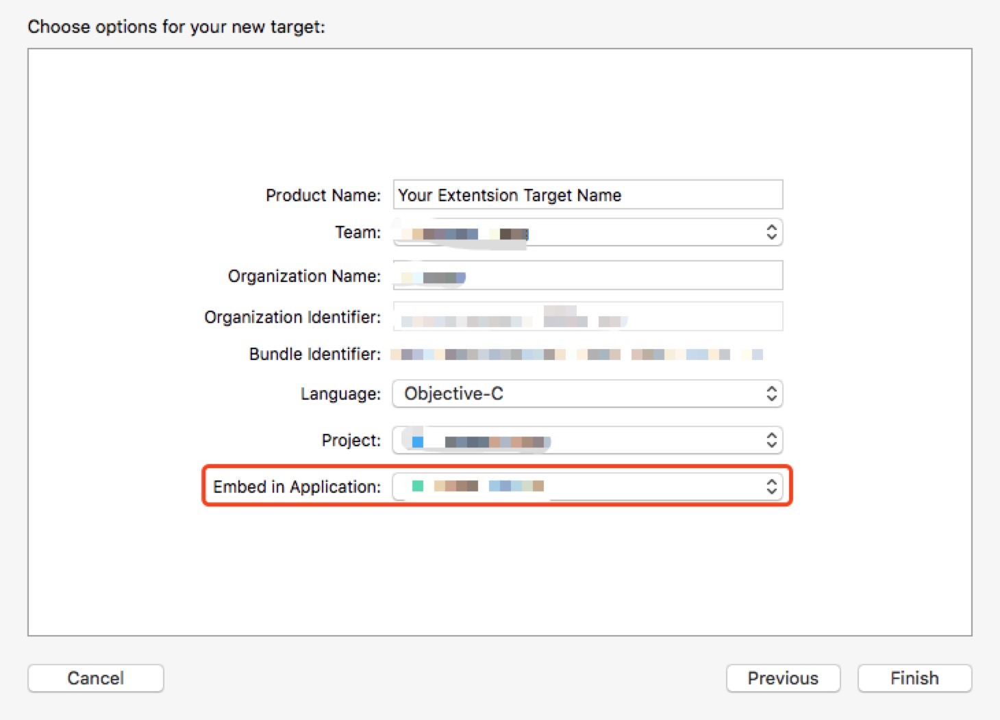
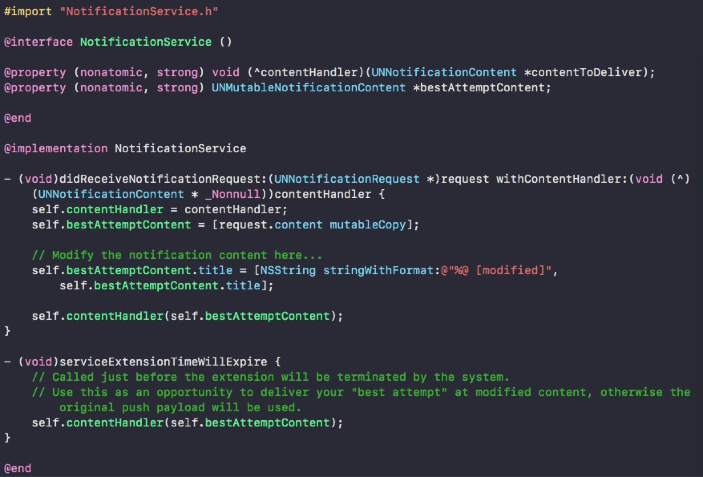
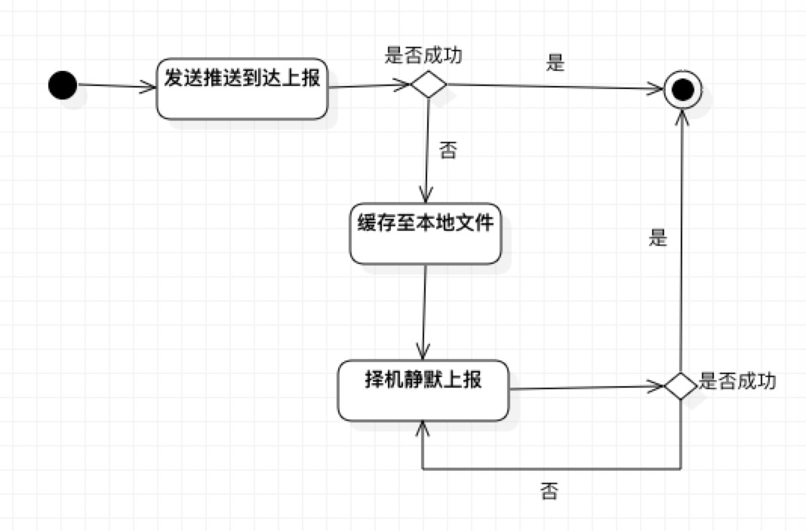
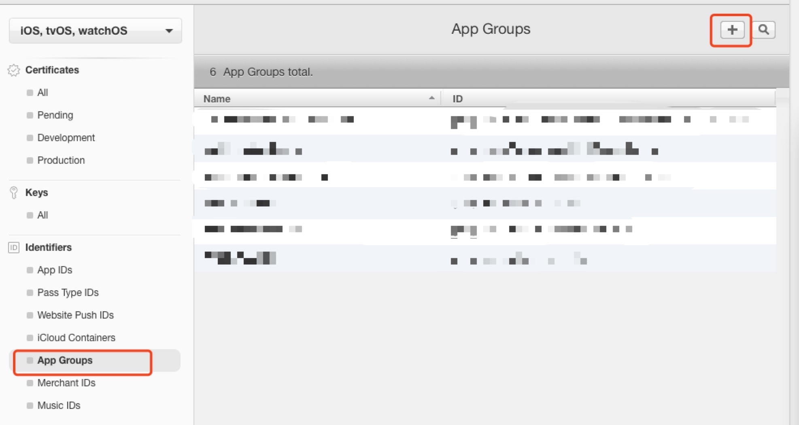
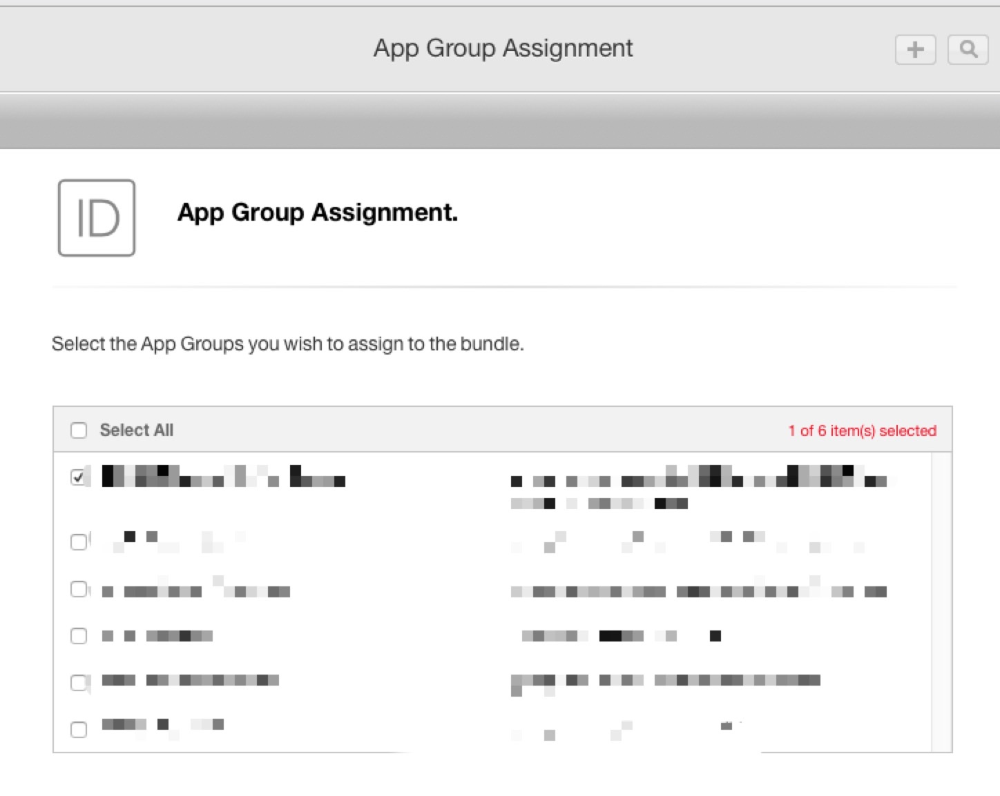
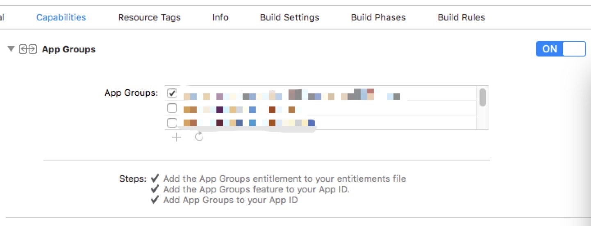

### 使用NotificationServiceExtension统计iOS推送到达率
##### 前言
由于业务需要，运营的同学一直希望知晓到底多少用户收到了我们的推送，安卓生态中一些运营商的SDK提供了是否到达的回执，但是iOS生态中，苹果在这块没有相应的功能，好消息是从iOS10之后苹果推出了NotificationServiceExtension，这个Extension可以让我们在客户端收到通知后，有机会去修改它，那么很容易想到，可以在这做个拦截，去记录和上报客户端所收到的通知消息，服务器就可以知道到底有多少终端收到了push。另外由于只有iOS10及以上支持NotificationServiceExtension，所以在iOS10以下是没法统计的，不过实测iOS9虽然没有Extension功能，但是并不影响使用APP。
##### 1.创建Extension
打开Xcode客户端，file—>new—>target—>NotificationServiceExtension



在创建的时候会让你选择希望植入（绑定）这个extension的APP，他们之间是一对一的关系，因为我们云课堂这边测试和线上的target是两个不同的，所以对应的extension创建了两份，这里需要注意一下。



创建好之后就可以在对应target的general下看到了


##### 2.在苹果后台添加对应的APPID
想要真机编译通过，我们增加的target相当于增加了一个新的微型APP，此时就应该在iOS开发者账号的苹果后台创建一个相应的APPID，以便证书验证通过，一般APPID为宿主APP的ID+extension的名字，例如：com.xxx.xxx.pushExtension，iOS开发者都知道怎么添加APPID这里就不图示了。

##### 3.NotificationService
下图是创建之初的初始代码，苹果已经帮我们准备好了收到消息的时候所调用的方法，很容易看到我们可以在didReceiveNotification中修改内容，然后调用这段代码返回数据，展示通知。
```
self.contentHandler(self.bestAttemptContent)
```


另外值得注意的是，还有serviceExtensionTimeWillExpire方法，如其本身注释已经写的很清楚，这里提供给我们最后一次机会展示自己修改过的通知，否则就会使用原始的通知展示，其实苹果给我们修改通知的时间是有限制的，也就是这个extension不能一直运行着，一定时间之后系统就会终止它，其实后面我们会发现这个extension就是一个单独的进程，在手机收到通知后，配置了extension的APP就会启动对应的进程，做对应的事情，主动结束或者超时结束之后系统会收回这个进程。
这里能提供给我们的时间，官方文档并没有说清楚，我实际测了一下大概在10秒内，7，8秒左右。也就是说如果这个修改通知的代码运行时间超过了十秒，苹果就会自动展示原始状态的通知。

另外需要注意的是，不是所有通知都会触发这个extension，苹果要求我们必须符合两个条件才可以：
    1. 通知中含有alert参数
    2. 通知中含有key为mutable-content且value为1的键值对。
这个alert参数一般通知肯定都是有的，mutable-content需要后端同学帮忙修改一下。

##### 4.上报策略

其实我们的上报服务器的策略也比较简单，一句话总结就是：收到推送后上报，如果上报失败则缓存本地择机上报，直至上报成功。



上报的数据是由后端同学提前塞在push的userinfo中，由客户端取出，再原封不动的发送给服务端，此处值得注意的是，在extension中不可以引用宿主APP的网络库，也不推荐给extension这个微型APP引入什么三方库，直接使用原有的NSURLSession就可以了。

逻辑很简，但是这里有个问题是，在什么时候静默上报，首先不推荐在extension里面做，因为在extension的进程里面每次我们能够处理逻辑的时间只有有限的几秒。那么如果在宿主APP里面做的话，如何让extension进程的数据能够被宿主APP获得呢，有的同学说，直接存到沙盒里，很不幸，extension相当于一个微型的APP，它和宿主APP是在不同的沙盒里面。这也就引出了下一个问题，extension和宿主APP如何共享数据。

##### 5.共享数据
那么如何共享数据呢，这里就要引出苹果的一个概念了，AppGroup了，简单来说，我们创建一个AppGroup，把我们希望互相能够共享数据的APPID添加进同一组group里面，他们就可以通过某种方式互相访问共享区域的数据了。首先需要在开发者账号下添加一个AppGroup



然后把对应想添加的APP添加进group里面去，选择APPID->Edit->AppGroups Edit 就会进入这个页面，在自己想要进入的AppGroup上打钩




如果想要顺利编译的话，Xcode工程这里也需要勾选一下
    

这样，我们就可以通过以下代码在extension和宿主APP中访问同一块共享“沙盒”了，我们可以像往常一样在里面创建文件，写入数据，从而达到共享数据的目的。

```
- (NSURL *)shareFilePath {
    //获取分组的共享目录
    NSURL *groupURL = [[NSFileManager defaultManager] containerURLForSecurityApplicationGroupIdentifier:kPushServiceAppGroupName];
    return [groupURL URLByAppendingPathComponent:kPushSendedReportLocalCacheFileName];
}

- (NSArray *)getAllData {
    if (![self shareFilePath]) {
        return nil;
    }
    if ([[NSFileManager defaultManager] fileExistsAtPath:[self shareFilePath].path]) {
        return [[NSArray alloc] initWithContentsOfFile:[self shareFilePath].path];
    } else {
        return nil;
    }
}

- (bool)saveData:(NSArray *)array {
    if (![self shareFilePath]) {
        return false;
    }
    bool result = [[array description] writeToFile:[self shareFilePath].path atomically:YES encoding:NSUTF8StringEncoding error:nil];
    return result;
}
```

##### 6.如何断点调试
因为不属于同一进程，不仅断点不能命中，连输出信息在默认的状态下都看不到，这里是因为默认状态下extension的进程根本没有被调试工具attach到，我们需要给调试手机发送一条push，让系统启动extension进程，然后在XCode的->debug->Attach to Process->选择自己的extension进程，再试试，是不是断电可以命中啦。


##### 后记
感谢强哥(Ken)的鼎力支持，由于添加NotificationServiceExtension引起了不少打包机器的问题，在解决的过程中强哥帮忙不少，另外感谢后端同学所提供的支持和后续的统计计算工作。


