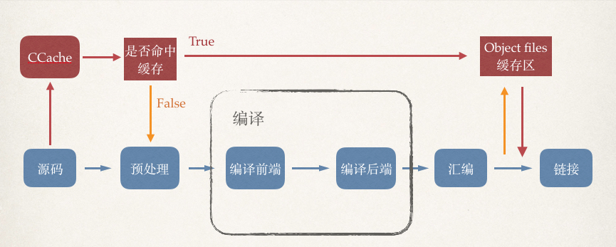
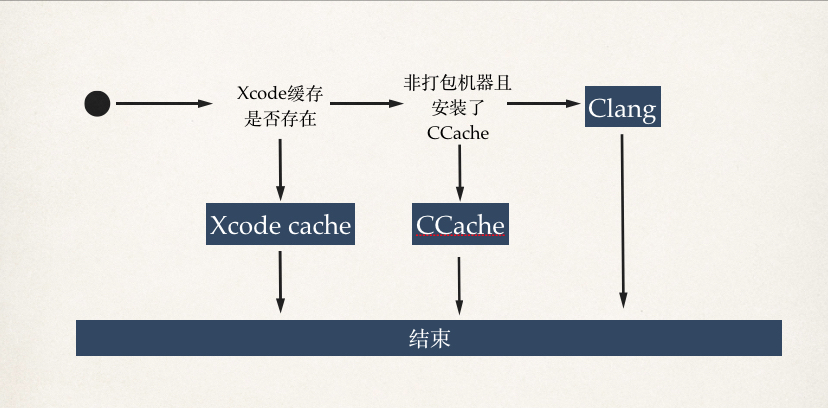
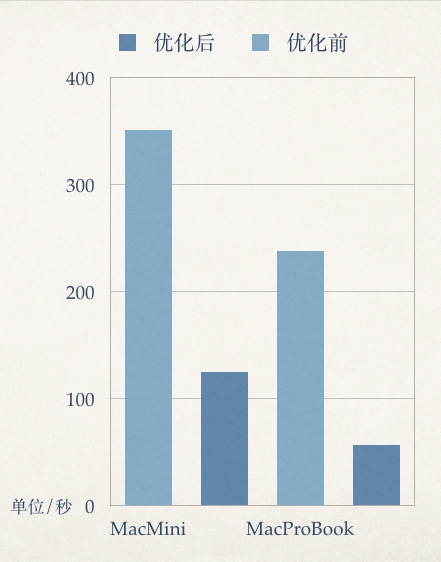
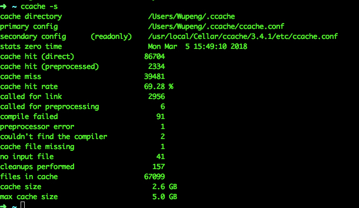
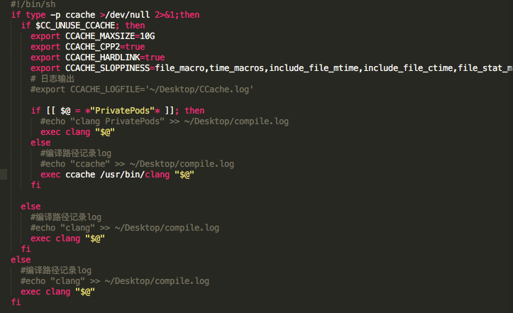
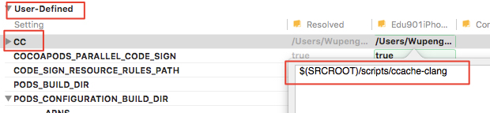
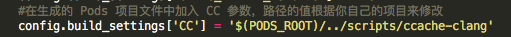
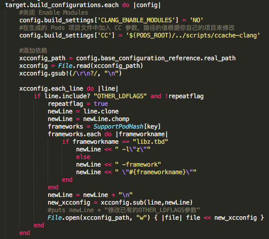

#### 编译提效方案文档
##### 1.为什么要做编译提效的工作？
随着业务越来越复杂，以及不同阶段所背负的历史包袱，不可避免的代码会不断的增多，编译效率会不断变低，虽然Xcode给我们提供了增量编译的功能，但是并不友好，缓存不可控，实际效果大家也有体会。所以为了使开发人员更加有效率愉快的工作，怎么解决编译效能的问题突显了出来。
##### 2.常见的方案
1. 打包为静态库，这种方向是把私有库或者三方库直接编译为静态库成品，以便编译的时候直接链接使用，这种方式是直接省略了私有库或者静态库的编译过程，所以能够节约整体的时间。代表Cocoapods-packager Carthage等，但是这种方式有以下几个缺陷
    1. 对经常变化的私有库无能为力
    2. 强行使用需要不断编译为静态库，反而得不偿失
    3. 调试比较麻烦
2. 分布式编译，这种方式比较适合大型项目，并且对网络带宽的要求比较高，代表有Distcc，但是结合我们的项目实际，这种方式并不是很适用。
3. 缓存编译结果，这种方式是另外一个思路，代表有Facebook的Buck,以及适用于c系语言的CCache。他们分别有以下的特点
    1. Buck是由Facebook推出的智能增量编译方案，比较大，但是通用，支持iOS,安卓,Java。但是它完全摒弃了Xcode的编译流程，自己构建了一套开发调试系列工具，考虑的团队的使用成本这个太重了，也不是很好。
    2. CCache是一个轻量的缓存编译文件工具，简单灵活。但也有缺点，就iOS而言，只支持C系语言,对Swift不适用。但整体比较适合当前我们的产品现状。

##### 3.CCache是如何提效编译的？
下面这张图基本就阐述了CCache的工作原理。



1. 蓝色部分为正常的编译流程大家都很熟悉了。
2. 红色及黄色部分为CCache所增加的部分，其中红色的路径为命中已缓存文件的时候，黄色路径为未命中的时候，在未命中目标文件缓存时，还是用使用原本的编译器进行编译然后保存结果文件至缓存区。

##### 4.目前项目中的实际编译流程



在编译逻辑之外，主要加入了项目适配的一些逻辑，在打包的过程中使用默认的编译器，以防一些不可知的风险，编译提效主要应用在开发过程中提升效率。

##### 5.实际的效果
全量编译测试效果如下图所示，现在代码已经合入我们的开发分支，实际使用的效果也是不错，开发心情愉快了许多^.^.


可以看到，在优化前和优化后效果有明显的差异，提升的不少，在MacMini上全量编译时间由351秒缩短至124秒，在MacBookPro上全量编译时间由238秒提升至56秒，有数倍之差。

##### 6.那么效果这么好，我们怎么用起来？

1. 安装CCache
    命令如下:
     ```shell
    brew install ccache
    ```
    可使用ccache -s 来查看是否安装成功，这个命令会显示ccache当前的状态，一些可配置的信息，具体可以手册<https://ccache.samba.org/manual/latest.html>
    
     
    可以看到，我这边已经有2.6G的缓存了。 

2. 利用llvm帮我预留的命令来添加编译接管脚本，具体来说就是当我们command+b进行编译的时候会先跑到这个脚本里面。具体命令为CC代表编译C文件，CPLUSPLUS代表编译CPP文件，具体可以看这里<http://lists.llvm.org/pipermail/cfe-dev/2014-March/035816.html>
    所以需要创建两个脚本，ccache-clang用来编译C，ccache-clang++用来编译CPP，在这个脚本里我们可以动手脚，使用CCache来编译。具体代码已C为例如下:
    

    具体的操作办法:增加user-defined设置，添加CC命令，对应脚本路径，根据自己实际上面脚本所在的位置。


3. 这样就可以了，编译就会进入CCache路径，但是想要让CCache真的生效，我们需要关闭Xcode5以后所提供的Modules，之所以要关闭这个是因为Modules提供了我们便捷导入头文件的方式，以及做了一些优化，但是CCache的原理是需要使用原生C语言的预处理规范。考虑到对于编译效率明显的提升效果，我们还是可以放弃Modules的。关闭Modules会造成两个问题，第一个是不能使用@import语法，第二个是系统不再会自动帮我导入一些系统库。例如UIKit等。这两项的具体原因可以在<https://developer.apple.com/library/content/documentation/Xcode/Conceptual/WhatsNewXcode-Archive/Articles/xcode_5_0.html>中的complie一节找到。
    
    > 那么如何解决这些问题，对于主工程很好办，直接修改@import语法代码，并且导入为数不多的几个系统库就OK了，难点在于如何让我们的私有库也享受到缓存的效果。为了解决这个问题，我想了很多办法。最终也比较方便的解决了这个问题。
    
    > 首先，对于私有库或者三方库里的@import语法，私有库可以直接修改，三方库可以fork之后修改，如果实在不想fork三方库，下面也有被动方法去解决这个问题。
    
    > 对于link系统库的问题，因为无论是私有库还是三方库，我们在做pod install的时候，总是会重新构建各个库的工程文件，也就是framework的配置，我们可以手动在buildsetting里修改otherLinkerFlag，但是这样下次重新生成又会失效，有的同学说可以在podspec里面添加依赖一劳永逸，但是对于不收我们控制的三方库，这样做又显得太麻烦，并且侵入性比较高，得每个库都修改podspec.
    
    我具体的做法是这样，在podfile中添加脚本，利用podfile的钩子函数在生成所有的pod工程文件后利用脚本去修改这些工程文件中的otherLinkerFlag参数，把对应需要的系统空添加进去.
    在podfile文件中引入rb脚本.
    
    ```ruby
    #引入
    require_relative "scripts/cc.rb"
    
    #在钩子函数中使用脚本
    post_install do |installer|
    ccclass = CC.new
    ccclass.updatePodsTargetsBuildSetting installer
    end
    ```
    在CC.rb里面维护了两个表，其中SupportPodHash是私有库所需要的系统库表，便于脚本操作，另外一个UnSupportPodArray是需要屏蔽的库的列表，例如一些比较麻烦的库,这里就屏蔽掉了，意味着不会去修改其Modules,也不会去修改其他的东西，但这样针对JYVLive就不会有缓存了。上面提到的一些麻烦的库不想支持的，就可以在这里去屏蔽它。此外值得一提的是，如果不在支持的列表里面也不会去修改，所以对于不想支持的库，要么直接不要在SupportPodHash表里面出现，要么SupportPodHash里有，需要在UnSupportPodArray里面屏蔽。对于教育产品里面不同的产品，大部分情况下着这个脚本是可以通用的，少数情况下使用的某个私有库的分支大家不一样，不同的分支里可能依赖的系统库不一样，这样就是不同的产品要做一下微调。
    
这里需要特别注意，路径要改为和自己脚本所在位置匹配的。

    关键代码如下:

    这里所做的操作就是如何去修改POD的buildsetting里面的otherLinkerFlag参数。以达到我们的目的。

    > 好了，基本到这里就差不多可以用了

    后记，遇到任何编译不通过的情况，首先考虑是不是链接库不对。


