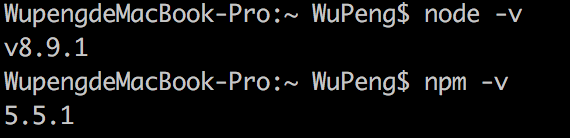
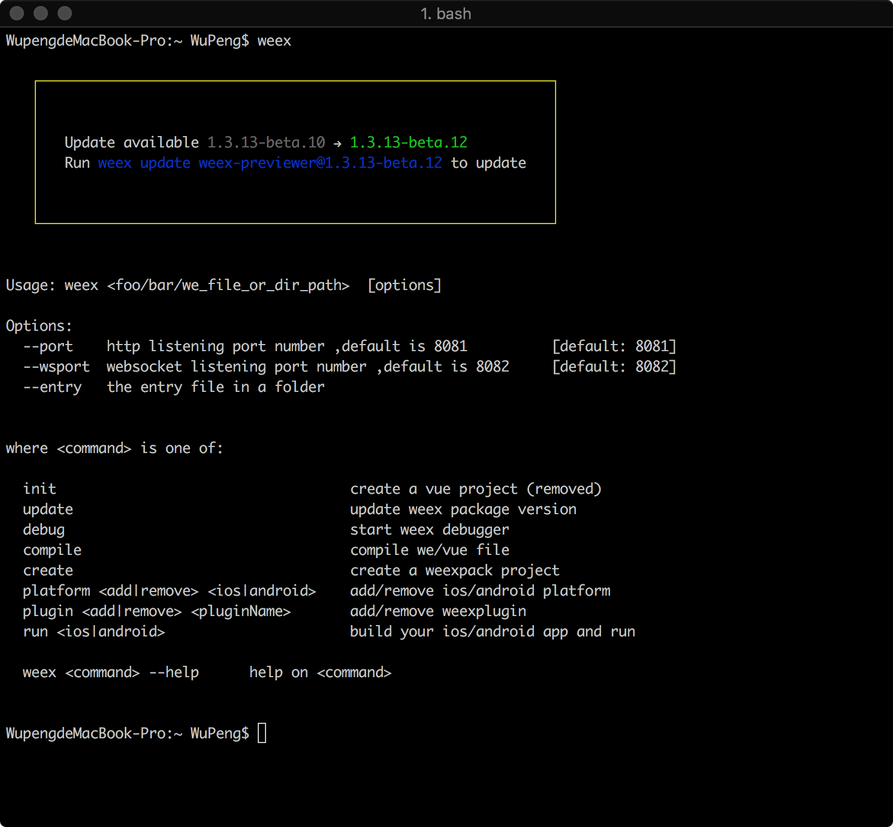
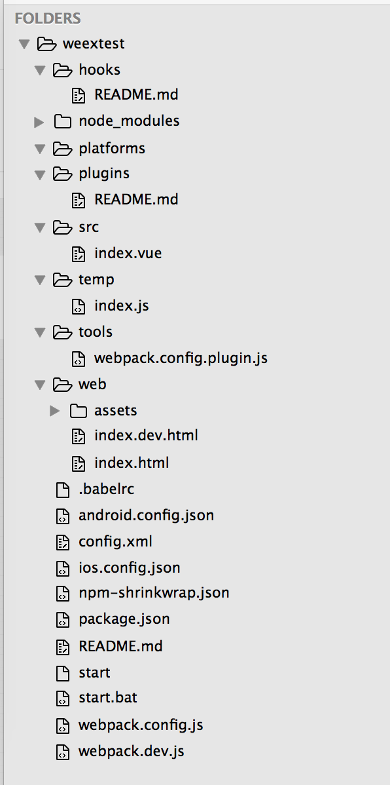
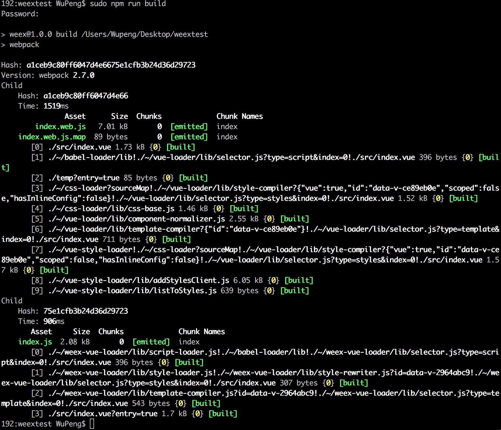
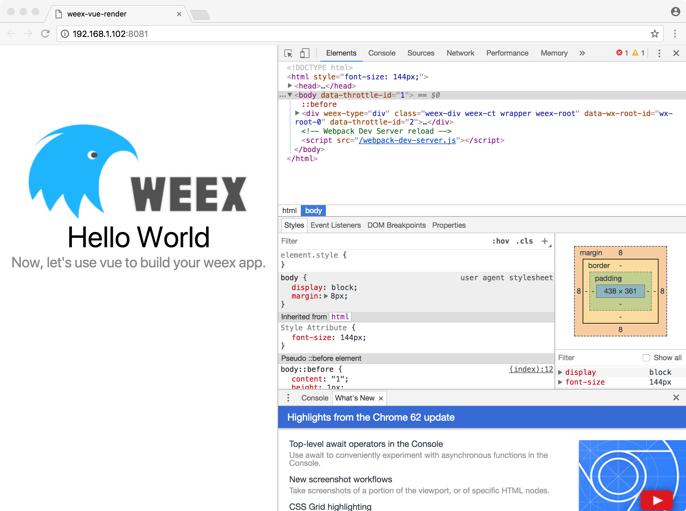
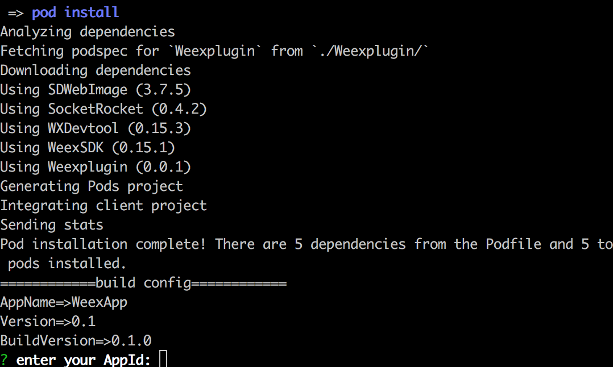

#### Weex—初识

​	大前端统一开发方案当前在市场上有很多，从去年的ReacNative特别火，到后来阿里推出的Weex等，一直想从某种角度入手去学习一些除iOS原生开发之外的一些东西，经过对比之后，感觉Weex比较适合，她的优势是轻量，灵活，和原生一样的流畅度，热更新，三端统一，但是缺点也很明显，也是RN一样具有的，不能全面的覆盖移动端的特性，每年移动端都会出一些新的特性，比如今年推出的人脸识别。此外，在性能方面可能会有些许差异，关于这个具体后面我会做一些实验，总结出一篇文章出来。

​	那么闲话不多说我们开始。

##### 环境要求：

- macOS
- Homebrew

- Node
- Npm
- Xcode (编译iOS)
- Android Studio （编译安卓）
- Weex-toolkit
- Weexpack

是不是站一看有点多，没关系，我一条一条慢慢说，因为我个人使用的环境是Mac，所以以下配置过程都是在Mac中完成的，请酌情参考。

​	Homebrew是Mac系统平台上的包管理器，是神器，墙裂建议安装。不过这里你也必须安装~。~，假如你的Mac上没有安装Homebrew,请先安装。安装方法：

~~~
/usr/bin/ruby -e "$(curl -fsSL https://raw.githubusercontent.com/Homebrew/install/master/install)"
~~~

​	Node.js是一个基于Chrome V8引擎的JavaScript运行环境，编译JS代码需要的环境。这一步就需要上面brew安装完成。

~~~
brew install node
~~~

​	安装完成后检测是否安装成功，建议安装至最新版本。

~~~
node -v
npm -v
~~~

​	Npm是Node自带的包管理工具，类似于iOS领域中的Pod，在我们安装Node的时候也会把npm安装上。可以设置npm镜像加速下面步骤的速度。

~~~
npm config set registry https://registry.npm.taobao.org --global
npm config set disturl https://npm.taobao.org/dist --global
~~~

​	Xcode和Android Studio都是为了编译不同平台的工具。

​	Weex-toolkit是官方的一个工具，可以用来创建，调试，打包Weex项目。

~~~
npm install -g weex-toolkit
~~~

​	安装成功后是这样子的，我这里有个提示更新的提示，正常的话应该是没有。

​	Weexpack是新一代的weex应用工程和插件工程开发套件，是基于weex快速搭建应用原型的利器。它能够帮助开发者通过命令行创建weex应用工程和插件工程，快速打包 weex 应用并安装到手机运行，对于具有分享精神的开发者而言还能够创建weex插件模版并发布插件到weex应用市场。 使用weexpack 能够方便的在在weex工程和native工程中安装插件。

​	简单的说，如果使用Weex做单页面那么Weex-toolkit就可以了，如果整个App都使用Weex开发，那么Weexpack比较方便，并且在调试不同平台的时候，个人觉得比较好用。

~~~
npm install -g weexpack //全局安装
~~~

##### 创建工程

​	配置好环境之后，我们就可以使用weexpack开始创建工程了。使用weexpack可以让我们快捷的生成iOS和安卓平台的工程模板，目的是在各自平台的模拟器或者真机上可以查看 Weex 运行的效果。

~~~
weexpack create 你的工程名
~~~

​	生成好工程之后cd，进入工程目录里面，进行npm install安装一些依赖包，这一步有点像iOS上面的pod install。

~~~
cd 你的工程名
npm install
~~~

​	这就是生成好的项目目录结构。

​	上面提到过，我们可以使用weexpack生成iOS和安卓平台的工程模板。输入下面的命令后，我们可以在工程目录里的platforms里发现相关代码。

~~~
weexpack platform add ios
weexpack platform add android
~~~

​	刚才生成的工程里的helloweex代码就是位于/src/index.vue文件里，Weex使用了Vue框架，所以这里也是Vue类型的文件。

~~~vue
<template>
  

    <image :src="logoUrl" class="logo"></image>
    <text class="title">Hello {{target}}</text>
    <text class="desc">Now, let's use vue to build your weex app.</text>
  

</template>

~~~

##### 运行效果

​	首先我们看一下在web端运行的效果，建议都加上sudo权限。

~~~
npm run build //源码打包，生成 JS Bundle
npm run dev //webpack watch 模式，方便开发
npm run serve //开启HotReload服务器，代码改动的将会实时同步到网页中
~~~

​	打包成功		  

​	web运行效果

​	web运行成功之后我们去试试模拟器的运行效果，因为目前博主只是安装了Xcode，所以就试一下在iOS平台的效果吧。官方的指令weex run ios命令问题很多，我们只使用build命令，运行还是自己手动去运行，当然在执行build命令之前，前面的add platform命令是前置条件。

~~~
weex build ios
~~~

​	在运行到需要输入APPID的时候control+c退出，这里可以自己使用xcode自由修改。

​	build之后我们就可以去找生成好的代码运行了。位置在platforms/ios/weexDemo.xcworkspace打开使用xcode运行。

至此我们已经进入了weex。